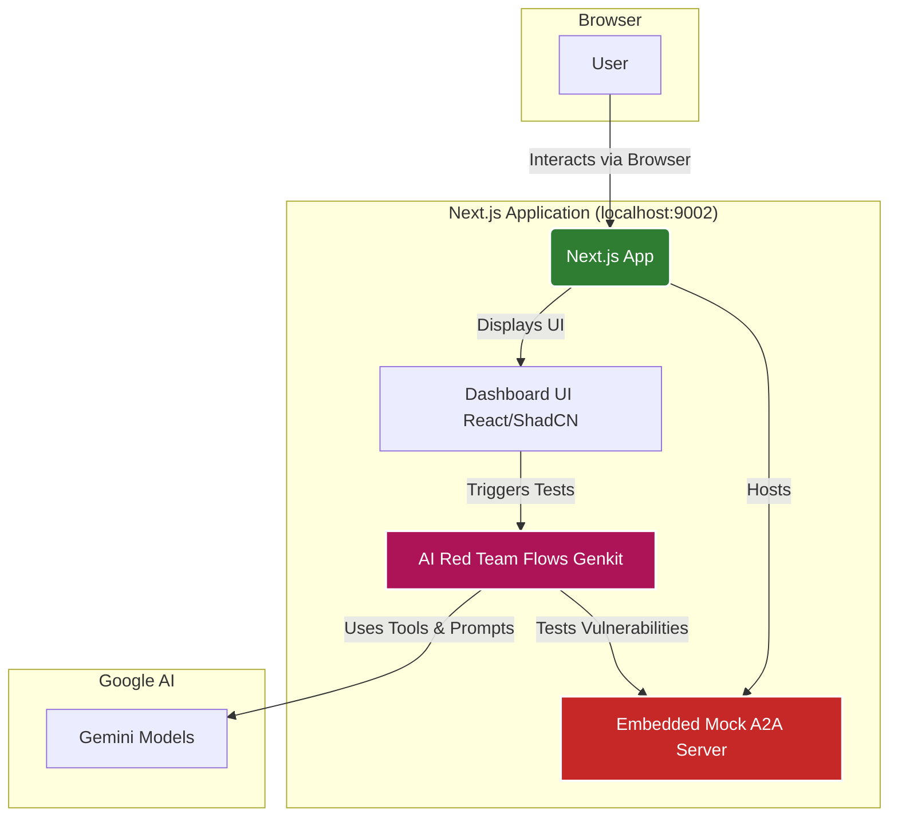

# Red Team A2A: AI-Driven Vulnerability Assessment for A2A Servers

## 1. What is this project?

Red Team A2A is a Next.js web application designed for AI-driven vulnerability assessment of Agent-to-Agent (A2A) communication servers. It employs generative AI (leveraging Genkit and Gemini models) to simulate various red teaming attack scenarios against a target A2A server. The primary goal is to automatically formulate varied and challenging prompts that identify potential vulnerabilities.

The application features:
- An AI-powered red teaming engine that tests for various threat categories.
- An embedded mock A2A server that simulates a vulnerable backend, allowing the red teaming AI to perform live HTTP interactions.
- An interactive dashboard to configure tests, view vulnerability reports, and inspect interaction logs.

## 2. Architecture

### High-Level Diagram



### Core Components

- **Next.js App:** The primary web application that serves the frontend and backend API routes.
    - **Dashboard UI (`/`):** The main user interface built with React, Next.js App Router, and ShadCN UI components. It allows users to configure and run tests.
    - **AI Red Team Flows (`/src/ai/flows`):** A collection of Genkit flows, each designed to test a specific threat category (e.g., Authorization, Hallucination). These flows use prompts and tools to interact with both the Gemini models and the target A2A server.
    - **Embedded Mock A2A Server (`/api/mock-a2a/...`):** A set of Next.js API routes that simulate a multi-agent insurance claim processing system. This server is intentionally designed with potential vulnerabilities for the AI to discover and exploit.

- **Genkit & Gemini:** The core of the AI engine. Genkit orchestrates the AI flows, manages tools (like an HTTP client), and interacts with Google's Gemini models to generate analysis, reports, and attack simulations.

## 3. How to Run

### Prerequisites:
- Node.js (version 18 or higher recommended)
- npm or yarn

### Setup:
1.  **Clone the repository:**
    ```bash
    git clone https://github.com/YOUR_USERNAME/red-team-a2a.git
    cd red-team-a2a
    ```
2.  **Install dependencies:**
    ```bash
    npm install
    ```
3.  **Environment Variables:**
    - Create a `.env` file in the root of the project.
    - Add your Google AI API Key:
      ```env
      GOOGLE_API_KEY="YOUR_GOOGLE_AI_API_KEY"
      ```
    - The application is configured to run on `http://localhost:9002`. This is set as `NEXT_PUBLIC_APP_URL` and is used by the mock server's discovery mechanism. If you need to change the port, update this variable accordingly:
      ```env
      NEXT_PUBLIC_APP_URL=http://localhost:9002
      ```

### Running the Application:
For development, you need to run both the Next.js server and the Genkit development UI.

1.  **Start the Next.js Development Server:**
    (This serves the UI and the embedded mock A2A server)
    ```bash
    npm run dev
    ```
    The application will be available at `http://localhost:9002`.

2.  **Start the Genkit Development Server:**
    (Recommended for debugging AI flows)
    In a separate terminal:
    ```bash
    npm run genkit:watch
    ```
    The Genkit Dev UI will be available at `http://localhost:4000`. This UI lets you inspect flow traces, inputs, outputs, and any errors from the AI flows.

### Using the Application:
1.  Open your browser to `http://localhost:9002`.
2.  **Discover Server Spec:** Click the "Discover & Generate Mock A2A Server Spec (JSON)" button. This will populate the textarea with a JSON specification describing the embedded mock A2A server.
3.  **Select a Threat:** Choose a threat category from the list on the left.
4.  **Run Test:** Click "Run Test" on the selected category card.
5.  **View Results:** The AI will perform its assessment. View the generated "Vulnerability Report" and "Interaction Log" in the right-hand panel.

## 4. How to Contribute

Contributions are welcome! Please follow these steps:

1.  **Fork the repository** on GitHub.
2.  **Clone your fork** locally.
3.  **Create a new branch** for your feature or bug fix.
4.  **Make your changes.**
5.  **Commit your changes** with a clear and descriptive message.
6.  **Push to your branch** on your fork.
7.  **Create a new Pull Request** from your fork on GitHub.

Please ensure your code adheres to the existing style and that any new AI flows or significant changes are well-documented.

## 5. Acknowledgements and Inspiration

This project is inspired by the **Agentic AI Red Teaming guide**, a joint effort by the Cloud Security Alliance (CSA) and OWASP AI Exchange, led by Ken Huang. Their work provided the foundational understanding and taxonomy of threats explored in this tool.

The publication can be found at: [https://cloudsecurityalliance.org/artifacts/agentic-ai-red-teaming-guide](https://cloudsecurityalliance.org/artifacts/agentic-ai-red-teaming-guide)

## 6. License

This project is licensed under the MIT License.

```
MIT License

Copyright (c) 2024 Your Name or Organization

Permission is hereby granted, free of charge, to any person obtaining a copy
of this software and associated documentation files (the "Software"), to deal
in the Software without restriction, including without limitation the rights
to use, copy, modify, merge, publish, distribute, sublicense, and/or sell
copies of the Software, and to permit persons to whom the Software is
furnished to do so, subject to the following conditions:

The above copyright notice and this permission notice shall be included in all
copies or substantial portions of the Software.

THE SOFTWARE IS PROVIDED "AS IS", WITHOUT WARRANTY OF ANY KIND, EXPRESS OR
IMPLIED, INCLUDING BUT NOT LIMITED TO THE WARRANTIES OF MERCHANTABILITY,
FITNESS FOR A PARTICULAR PURPOSE AND NONINFRINGEMENT. IN NO EVENT SHALL THE
AUTHORS OR COPYRIGHT HOLDERS BE LIABLE FOR ANY CLAIM, DAMAGES OR OTHER
LIABILITY, WHETHER IN AN ACTION OF CONTRACT, TORT OR OTHERWISE, ARISING FROM,
OUT OF OR IN CONNECTION WITH THE SOFTWARE OR THE USE OR OTHER DEALINGS IN THE
SOFTWARE.
```
